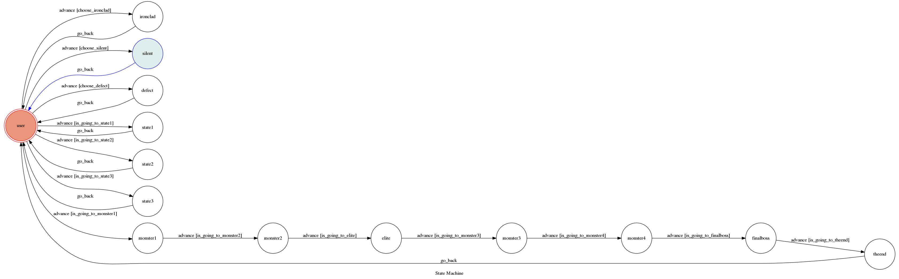

# TOC Project 2019

Template Code for TOC Project 2019

A Facebook messenger bot based on a finite state machine

More details in the [Slides](https://hackmd.io/p/SkpBR-Yam#/)

## Setup

### Prerequisite
* Python 3
* Facebook Page and App
* HTTPS Server

#### Install Dependency
```sh
pip install -r requirements.txt
```

* pygraphviz (For visualizing Finite State Machine)
    * [Setup pygraphviz on Ubuntu](http://www.jianshu.com/p/a3da7ecc5303)

#### Secret Data

`VERIFY_TOKEN` and `ACCESS_TOKEN` **MUST** be set to proper values.
Otherwise, you might not be able to run your code.

#### Run Locally
You can either setup https server or using `ngrok` as a proxy.

**`ngrok` would be used in the following instruction**

```sh
./ngrok http 5000
```

After that, `ngrok` would generate a https URL.

#### Run the sever

```sh
python3 app.py
```

## Finite State Machine


## Usage
The initial state is set to `user`.

Every time `user` state is triggered to `advance` to another state, it will `go_back` to `user` state after the bot replies corresponding message.

* user
	* Input: "go to state1"
		* Reply: "I'm entering state1"

	* Input: "go to state2"
		* Reply: "I'm entering state2"

        * Input: "choose ironclad"
                * Reply: "I've chosen ironclad"

        * Input: "choose silent"
                * Reply: "I've chosen silent"

        * Input: "choose defect"
                * Reply: "I've chosen defect"

        * Input: "go slay the spire"
                * Reply: "I'm entering floor1"
* monster1
        * Input: "go to floor2"
                * Reply: "I'm entering floor2"
* monster2
        * Input: "go to floor3"
                * Reply: "I'm entering floor3"
* elite
        * Input: "go to floor4"
                * Reply: "I'm entering floor4"
* monster3
        * Input: "go to floor5"
                * Reply: "I'm entering floor5"
* monster4
        * Input: "go to floor6"
                * Reply: "I'm entering floor6"
* finalboss
        * Input: "go to floor7"
                * Reply: "I'm entering floor7"


## Reference
[TOC-Project-2017](https://github.com/Lee-W/TOC-Project-2017) ❤️ [@Lee-W](https://github.com/Lee-W)
